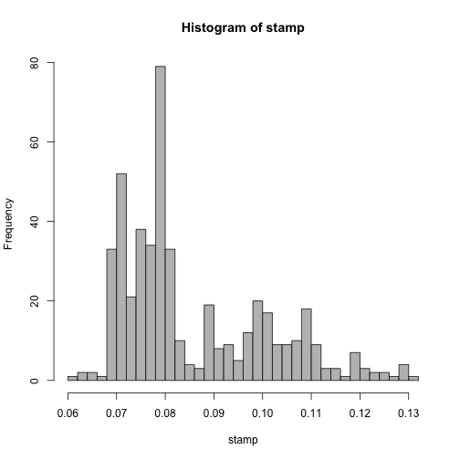
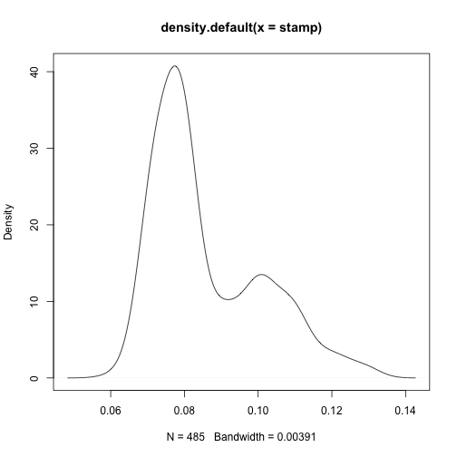

In class boostrap exercise
==========================

Instructions [here](https://docs.google.com/document/d/1mwYOkzZTKgPI-gpoI6UjIVl3mJEglQ1XhULoCst4u_o/edit).


```r
## Load data
library(bootstrap)
data(stamp)
stamp <- stamp[[1]]
```


# Point 7


```r
## Histograms
hist(stamp, breaks = 20, col = "grey")
```

 

```r
hist(stamp, breaks = 50, col = "grey")
```

 

```r
hist(stamp, breaks = 100, col = "grey")
```

 


```r
## Density
plot(density(stamp))
```

 

```r
plot(density(stamp, bw = "SJ"))
```

 


# Point 8

Think about changing the bandwidth of the density function.


```r
x <- density(stamp, bw = "SJ")
names(x)
```

```
## [1] "x"         "y"         "bw"        "n"         "call"      "data.name"
## [7] "has.na"
```

```r
x$bw
```

```
## [1] 0.001205
```

```r

## localMaxima from Tommy at
## http://stackoverflow.com/questions/6836409/finding-local-maxima-and-minima
localMaxima <- function(x) {
    # Use -Inf instead if x is numeric (non-integer)
    y <- diff(c(-.Machine$integer.max, x)) > 0L
    rle(y)$lengths
    y <- cumsum(rle(y)$lengths)
    y <- y[seq.int(1L, length(y), 2L)]
    if (x[[1]] == x[[2]]) {
        y <- y[-1]
    }
    y
}
x$x[localMaxima(x$y)]
```

```
## [1] 0.06006 0.06465 0.07139 0.07935 0.08961 0.10048 0.10951 0.11961 0.12910
```

