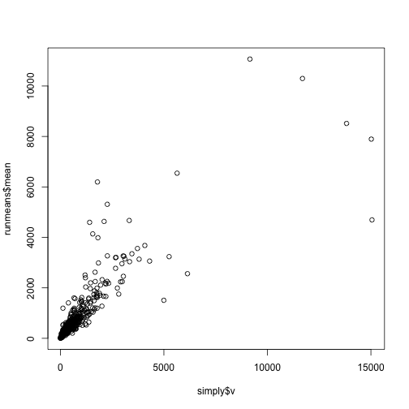
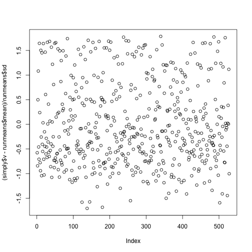
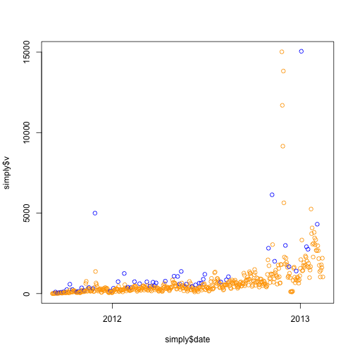
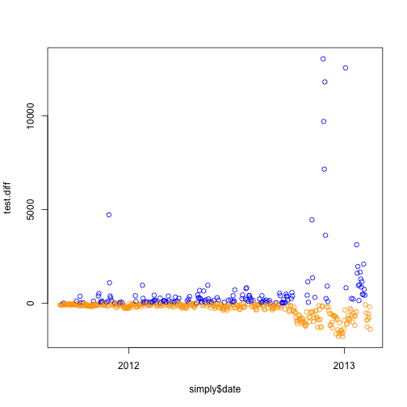
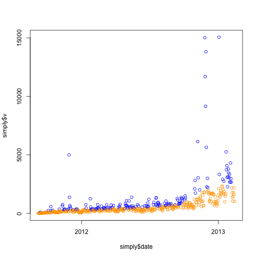
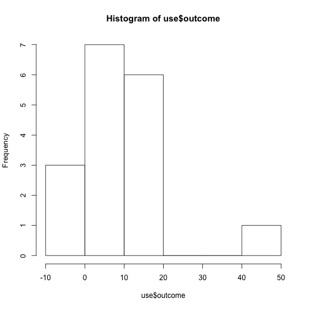
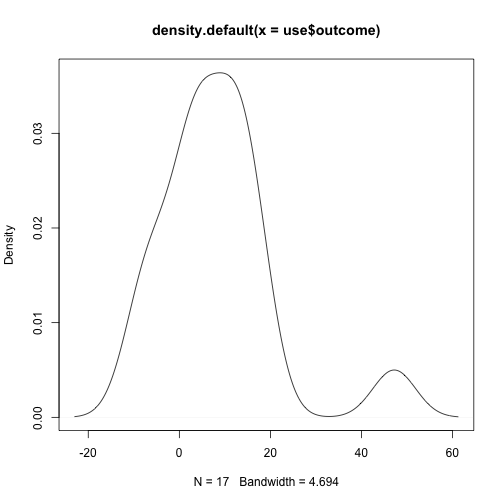
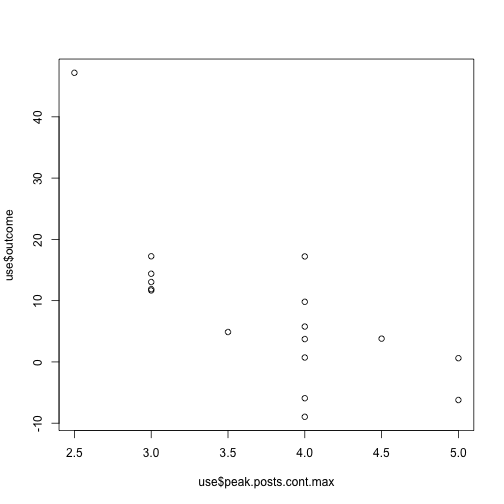
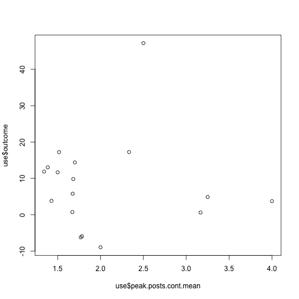
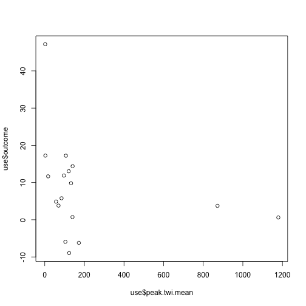

Find Peaks
=========


```r
## Load data
load("../../data/simply.Rdata")
load("../../data/posts.controversy.proc.Rdata")

## Calculate running means by 5 days I ran this with +-3 days and the
## results look worse in the sense that many peaks are next to each other.
getRunMeans <- function(window = 2) {
    runmeans <- data.frame(start = simply$date - window, end = simply$date + 
        window, mean = rep(NA, nrow(simply)))
    for (i in 1:nrow(runmeans)) {
        runmeans$mean[i] <- mean(simply$v[simply$date >= runmeans$start[i] & 
            simply$date <= runmeans$end[i]])
    }
    return(runmeans)
}
runmeans <- getRunMeans()


## Some EDA on the running means
plot(simply$date, runmeans$mean)
```

 

```r
plot(simply$v, runmeans$mean)
```

 

```r
## This one looks useful to choose the peaks
plot(simply$v - runmeans$mean)
abline(h = 0, col = "red")
```

 

```r

diff <- simply$v - runmeans$mean
plot(density(diff))
```

 

```r
summary(diff)
```

```
##    Min. 1st Qu.  Median    Mean 3rd Qu.    Max. 
##   -4410    -109     -17       0      59   10400
```

```r
## Not normal
qqnorm(diff)
```

 

```r

## Exploring the simply > 0 cutoff
plot(simply$date, simply$v, col = ifelse(diff > 0, "blue", "orange"))
```

 

```r
## It doesn't look great as some high values are marked in orange.  But in
## another sense, blue values are higher than orange ones.

## Looking at this in another way
boxplot(simply$v ~ diff > 0)
```

 

```r
t.test(simply$v ~ diff > 0)
```

```
## 
## 	Welch Two Sample t-test
## 
## data:  simply$v by diff > 0 
## t = -3.897, df = 285.7, p-value = 0.0001213
## alternative hypothesis: true difference in means is not equal to 0 
## 95 percent confidence interval:
##  -815.1 -268.0 
## sample estimates:
## mean in group FALSE  mean in group TRUE 
##               572.1              1113.7
```

```r
## Good significant difference
table(diff > 0)
```

```
## 
## FALSE  TRUE 
##   301   227
```

```r

### Time to find a better cutoff.

## 3rd quantile?
plot(simply$date, simply$v, col = ifelse(diff > quantile(diff, 0.75), "blue", 
    "orange"))
```

 

```r
table(diff > quantile(diff, 0.75))
```

```
## 
## FALSE  TRUE 
##   396   132
```

```r

## .9 quantile?
plot(simply$date, simply$v, col = ifelse(diff > quantile(diff, 0.9), "blue", 
    "orange"))
```

 

```r
table(diff > quantile(diff, 0.9))
```

```
## 
## FALSE  TRUE 
##   475    53
```

```r
boxplot(simply$v ~ diff > quantile(diff, 0.9))
```

 

```r
t.test(simply$v ~ diff > quantile(diff, 0.9))
```

```
## 
## 	Welch Two Sample t-test
## 
## data:  simply$v by diff > quantile(diff, 0.9) 
## t = -4.456, df = 52.53, p-value = 4.405e-05
## alternative hypothesis: true difference in means is not equal to 0 
## 95 percent confidence interval:
##  -3108 -1178 
## sample estimates:
## mean in group FALSE  mean in group TRUE 
##               589.8              2733.1
```

```r


## Lets take into accout the variation during the windows
runmeans$sd <- rep(NA, nrow(simply))
for (i in 1:nrow(runmeans)) {
    runmeans$sd[i] <- sd(simply$v[simply$date >= runmeans$start[i] & simply$date <= 
        runmeans$end[i]])
}

## Looks more 'Normal' as expected
plot((simply$v - runmeans$mean)/runmeans$sd)
```

 

```r

norm <- (simply$v - runmeans$mean)/runmeans$sd
qqnorm(norm)
qqline(norm, col = "red")
```

 

```r
## Hard to interpret T_T'

## Boxplot looks symmetric
boxplot(norm)
```

 

```r

## Shapiro Test (shouldn't take it's results much into account) indicate
## that it's not normal
shapiro.test(norm)
```

```
## 
## 	Shapiro-Wilk normality test
## 
## data:  norm 
## W = 0.9548, p-value = 1.215e-11
```

```r

## Summary info
summary(norm)
```

```
##    Min. 1st Qu.  Median    Mean 3rd Qu.    Max. 
## -1.7100 -0.6280 -0.1700 -0.0031  0.5410  1.7900
```

```r

## Surprinsingly bad results!
plot(simply$date, simply$v, col = ifelse(norm > quantile(norm, 0.9), "blue", 
    "orange"))
```

 


Taking a step back and looking at how the peaks would be using the quantile 0.9 for diff.


```r
plot(simply$date, simply$v, col = ifelse(diff > quantile(diff, 0.9), "blue", 
    "orange"))
```

 

```r
## Looks like some peaks are too close to each other
diff(simply$date[diff > quantile(diff, 0.9)])
```

```
## Time differences in days
##  [1] 31  1 17 45 12 20 10 14 18 18 17  7  7 28  7  4  4  3 13  6  1 26  3
## [24] 27  1 10 10  1 25  1  7  1  4  7  1  6  1  2  4  7  9  1  4 10 10  3
## [47]  6  2  4  3  3 10
```

```r
## 69 posts in those peak days out of 511 total
dim(posts[posts$date %in% simply$date[diff > quantile(diff, 0.9)], ])
```

```
## [1] 69  7
```

```r

## It's 10% days vs 13.5% posts
sum(diff > quantile(diff, 0.9))/length(diff)
```

```
## [1] 0.1004
```

```r
69/nrow(posts)
```

```
## [1] 0.135
```

```r

# quantile 0.95?
plot(simply$date, simply$v, col = ifelse(diff > quantile(diff, 0.95), "blue", 
    "orange"))
```

 

```r
diff(simply$date[diff > quantile(diff, 0.95)])
```

```
## Time differences in days
##  [1]  57 104   7  46  76  21  27   7   1   4   7   7   1   2   4   7   9
## [18]   1   4  10  10   3   6   6   6  10
```

```r
sum(diff > quantile(diff, 0.95))
```

```
## [1] 27
```


Looking at differences between the authors

```r

## Ahh, is the controversy related to the author?
tapply(posts$cont, posts$author, mean)
```

```
##           admin       Jeff Leek Rafael Irizarry      Roger Peng 
##           1.500           1.638           2.219           1.331 
## Steven Salzberg 
##           4.000
```

```r
with(posts, boxplot(cont ~ factor(author)))
```

 

```r
f <- lm(cont ~ factor(author), data = posts)
summary(f)
```

```
## 
## Call:
## lm(formula = cont ~ factor(author), data = posts)
## 
## Residuals:
##    Min     1Q Median     3Q    Max 
## -1.219 -0.638 -0.331  0.362  3.362 
## 
## Coefficients:
##                               Estimate Std. Error t value Pr(>|t|)  
## (Intercept)                      1.500      0.846    1.77    0.077 .
## factor(author)Jeff Leek          0.138      0.848    0.16    0.870  
## factor(author)Rafael Irizarry    0.719      0.851    0.84    0.399  
## factor(author)Roger Peng        -0.169      0.848   -0.20    0.842  
## factor(author)Steven Salzberg    2.500      1.197    2.09    0.037 *
## ---
## Signif. codes:  0 '***' 0.001 '**' 0.01 '*' 0.05 '.' 0.1 ' ' 1 
## 
## Residual standard error: 0.846 on 506 degrees of freedom
## Multiple R-squared: 0.129,	Adjusted R-squared: 0.122 
## F-statistic: 18.7 on 4 and 506 DF,  p-value: 2.36e-14
```

```r
anova(f)
```

```
## Analysis of Variance Table
## 
## Response: cont
##                 Df Sum Sq Mean Sq F value  Pr(>F)    
## factor(author)   4     54   13.39    18.7 2.4e-14 ***
## Residuals      506    362    0.72                    
## ---
## Signif. codes:  0 '***' 0.001 '**' 0.01 '*' 0.05 '.' 0.1 ' ' 1
```

```r
## very low p-value, butat that seems to be due to Steven's post
f2 <- lm(cont ~ factor(author), data = posts, subset = author %in% c("Jeff Leek", 
    "Rafael Irizarry", "Roger Peng"))
summary(f2)
```

```
## 
## Call:
## lm(formula = cont ~ factor(author), data = posts, subset = author %in% 
##     c("Jeff Leek", "Rafael Irizarry", "Roger Peng"))
## 
## Residuals:
##    Min     1Q Median     3Q    Max 
## -1.219 -0.638 -0.331  0.362  3.362 
## 
## Coefficients:
##                               Estimate Std. Error t value Pr(>|t|)    
## (Intercept)                     1.6385     0.0606   27.04  < 2e-16 ***
## factor(author)Rafael Irizarry   0.5803     0.1123    5.17  3.5e-07 ***
## factor(author)Roger Peng       -0.3073     0.0820   -3.75    2e-04 ***
## ---
## Signif. codes:  0 '***' 0.001 '**' 0.01 '*' 0.05 '.' 0.1 ' ' 1 
## 
## Residual standard error: 0.846 on 506 degrees of freedom
## Multiple R-squared: 0.116,	Adjusted R-squared: 0.113 
## F-statistic: 33.4 on 2 and 506 DF,  p-value: 2.48e-14
```

```r
anova(f2)
```

```
## Analysis of Variance Table
## 
## Response: cont
##                 Df Sum Sq Mean Sq F value  Pr(>F)    
## factor(author)   2     48   23.88    33.4 2.5e-14 ***
## Residuals      506    362    0.72                    
## ---
## Signif. codes:  0 '***' 0.001 '**' 0.01 '*' 0.05 '.' 0.1 ' ' 1
```

```r
## Ok, now all of the authors seem different!!

## Lets look at the Jeff vs Rafa vs Roger
table(posts$author)
```

```
## 
##           admin       Jeff Leek Rafael Irizarry      Roger Peng 
##               1             195              80             234 
## Steven Salzberg 
##               1
```

```r
posts.filt <- subset(posts, author %in% c("Jeff Leek", "Rafael Irizarry", "Roger Peng"))
t.test(posts.filt$cont ~ posts.filt$author == "Roger Peng")
```

```
## 
## 	Welch Two Sample t-test
## 
## data:  posts.filt$cont by posts.filt$author == "Roger Peng" 
## t = 6.368, df = 480.1, p-value = 4.482e-10
## alternative hypothesis: true difference in means is not equal to 0 
## 95 percent confidence interval:
##  0.3292 0.6230 
## sample estimates:
## mean in group FALSE  mean in group TRUE 
##               1.807               1.331
```

```r
t.test(posts.filt$cont ~ posts.filt$author == "Jeff Leek")
```

```
## 
## 	Welch Two Sample t-test
## 
## data:  posts.filt$cont by posts.filt$author == "Jeff Leek" 
## t = -0.9814, df = 399.1, p-value = 0.327
## alternative hypothesis: true difference in means is not equal to 0 
## 95 percent confidence interval:
##  -0.24366  0.08139 
## sample estimates:
## mean in group FALSE  mean in group TRUE 
##               1.557               1.638
```

```r
t.test(posts.filt$cont ~ posts.filt$author == "Rafael Irizarry")
```

```
## 
## 	Welch Two Sample t-test
## 
## data:  posts.filt$cont by posts.filt$author == "Rafael Irizarry" 
## t = -5.844, df = 95.76, p-value = 7.015e-08
## alternative hypothesis: true difference in means is not equal to 0 
## 95 percent confidence interval:
##  -1.0019 -0.4939 
## sample estimates:
## mean in group FALSE  mean in group TRUE 
##               1.471               2.219
```

```r
## Only Jeff is not significantly different from the other 2. I mean, Jeff
## vs (Roger + Rafa).

t.test(posts.filt$cont[posts.filt$author == "Roger Peng"], posts.filt$cont[posts.filt$author == 
    "Rafael Irizarry"])
```

```
## 
## 	Welch Two Sample t-test
## 
## data:  posts.filt$cont[posts.filt$author == "Roger Peng"] and posts.filt$cont[posts.filt$author == "Rafael Irizarry"] 
## t = -6.854, df = 100, p-value = 5.989e-10
## alternative hypothesis: true difference in means is not equal to 0 
## 95 percent confidence interval:
##  -1.1445 -0.6306 
## sample estimates:
## mean of x mean of y 
##     1.331     2.219
```

```r
t.test(posts.filt$cont[posts.filt$author == "Roger Peng"], posts.filt$cont[posts.filt$author == 
    "Jeff Leek"])
```

```
## 
## 	Welch Two Sample t-test
## 
## data:  posts.filt$cont[posts.filt$author == "Roger Peng"] and posts.filt$cont[posts.filt$author == "Jeff Leek"] 
## t = -3.886, df = 346.3, p-value = 0.000122
## alternative hypothesis: true difference in means is not equal to 0 
## 95 percent confidence interval:
##  -0.4628 -0.1518 
## sample estimates:
## mean of x mean of y 
##     1.331     1.638
```

```r
t.test(posts.filt$cont[posts.filt$author == "Rafael Irizarry"], posts.filt$cont[posts.filt$author == 
    "Jeff Leek"])
```

```
## 
## 	Welch Two Sample t-test
## 
## data:  posts.filt$cont[posts.filt$author == "Rafael Irizarry"] and posts.filt$cont[posts.filt$author == "Jeff Leek"] 
## t = 4.188, df = 127.5, p-value = 5.221e-05
## alternative hypothesis: true difference in means is not equal to 0 
## 95 percent confidence interval:
##  0.3061 0.8545 
## sample estimates:
## mean of x mean of y 
##     2.219     1.638
```

```r

## So, Rafa posts the most controversial posts followed by Jeff and
## finally Roger.
```


Ok, time to get the peaks for quantiles 0.9 and 0.95

```r

## Function that gets the start and end
limitPeak <- function(df) {
    data.frame(start = df$date[1], end = df$date[nrow(df)])
}
## Main function for finding the peaks
getPeaks <- function(df, diff, q, space = 1) {
    i <- which(diff > quantile(diff, q))
    dates <- df$date[i]
    dates.diff <- diff(dates)
    
    ## For peaks far from each other find the start and end date of the peak
    j <- which(dates.diff <= space)
    good <- i[-c(j, j + 1)]
    res <- lapply(good, function(x) {
        limitPeak(df[x, ])
    })
    res <- do.call(rbind, res)
    
    ## In peaks too close to each other, find the day with the highest value
    ## and call it the peak day
    if (length(j) > 0) {
        while (length(j) > 0) {
            k <- j[1]
            j <- j[-1]
            if (length(j) > 0) {
                while (j[1] - k[length(k)] == 1) {
                  k <- c(k, j[1])
                  j <- j[-1]
                  if (length(j) == 0) 
                    break
                }
            }
            info <- df[i[c(k, k[length(k)] + 1)], ]
            res <- rbind(res, limitPeak(info))
            ## Now that we have the k groups
        }
    }
    
    ## End
    res <- res[order(res$start), ]
    res$ndays <- as.integer(res$end - res$start) + 1
    return(res)
}

## Gets the peaks for quantile .9 and 0.95 for the difference.  Compare
## with space =1 and space = 2
p95 <- getPeaks(simply, diff, 0.95)
p95.2 <- getPeaks(simply, diff, 0.95, 2)
p90 <- getPeaks(simply, diff, 0.9)
p90.2 <- getPeaks(simply, diff, 0.9, 2)
p95
```

```
##         start        end ndays
## 1  2011-11-28 2011-11-28     1
## 2  2012-01-24 2012-01-24     1
## 3  2012-05-07 2012-05-07     1
## 4  2012-05-14 2012-05-14     1
## 5  2012-06-29 2012-06-29     1
## 6  2012-09-13 2012-09-13     1
## 7  2012-10-04 2012-10-04     1
## 8  2012-10-31 2012-10-31     1
## 22 2012-11-07 2012-11-08     2
## 9  2012-11-12 2012-11-12     1
## 10 2012-11-19 2012-11-19     1
## 23 2012-11-26 2012-11-27     2
## 11 2012-11-29 2012-11-29     1
## 12 2012-12-03 2012-12-03     1
## 13 2012-12-10 2012-12-10     1
## 24 2012-12-19 2012-12-20     2
## 14 2012-12-24 2012-12-24     1
## 15 2013-01-03 2013-01-03     1
## 16 2013-01-13 2013-01-13     1
## 17 2013-01-16 2013-01-16     1
## 18 2013-01-22 2013-01-22     1
## 19 2013-01-28 2013-01-28     1
## 20 2013-02-03 2013-02-03     1
## 21 2013-02-13 2013-02-13     1
```

```r
p95.2
```

```
##         start        end ndays
## 1  2011-11-28 2011-11-28     1
## 2  2012-01-24 2012-01-24     1
## 3  2012-05-07 2012-05-07     1
## 4  2012-05-14 2012-05-14     1
## 5  2012-06-29 2012-06-29     1
## 6  2012-09-13 2012-09-13     1
## 7  2012-10-04 2012-10-04     1
## 8  2012-10-31 2012-10-31     1
## 21 2012-11-07 2012-11-08     2
## 9  2012-11-12 2012-11-12     1
## 10 2012-11-19 2012-11-19     1
## 22 2012-11-26 2012-11-29     4
## 11 2012-12-03 2012-12-03     1
## 12 2012-12-10 2012-12-10     1
## 23 2012-12-19 2012-12-20     2
## 13 2012-12-24 2012-12-24     1
## 14 2013-01-03 2013-01-03     1
## 15 2013-01-13 2013-01-13     1
## 16 2013-01-16 2013-01-16     1
## 17 2013-01-22 2013-01-22     1
## 18 2013-01-28 2013-01-28     1
## 19 2013-02-03 2013-02-03     1
## 20 2013-02-13 2013-02-13     1
```

```r
dim(p90)
```

```
## [1] 44  3
```

```r
dim(p90.2)
```

```
## [1] 42  3
```

```r

## Checking posts in that large peak
subset(posts, date >= "2012-11-26" & date <= "2012-11-29")
```

```
##           date          author
## 505 2012-11-26       Jeff Leek
## 504 2012-11-27 Rafael Irizarry
##                                                                                          title
## 505 The statisticians at Fox News use classic and novel graphical techniques to lead with data
## 504                                                       I give up, I am embracing pie charts
##     type leo1 leo2 cont
## 505 <NA>    5    5    5
## 504 <NA>    4    4    4
```


Proceed to complete the information for the peaks


```r

completePeaks <- function(peak, df, post) {
    
    ### Get information from before the peak
    
    ## pre start day (1st day of data or last peak end + 1)
    pre.start <- sapply(1:nrow(peak), function(x) {
        if (x == 1) {
            res <- df$date[1]
        } else {
            res <- peak$end[x - 1] + 1
        }
        return(res)
    }, simplify = FALSE)
    pre.start <- do.call(c, pre.start)
    
    ## pre end day (1 day before the peak begins)
    pre.end <- sapply(1:nrow(peak), function(x) {
        peak$start[x] - 1
    }, simplify = FALSE)
    pre.end <- do.call(c, pre.end)
    
    ## Get max visits on pre-peak
    pre.v.max <- mapply(function(x, y) {
        z <- subset(df, date >= x & date <= y)
        max(z$v)
    }, pre.start, pre.end)
    pre.twi.max <- mapply(function(x, y) {
        z <- subset(df, date >= x & date <= y)
        max(z$twi)
    }, pre.start, pre.end)
    
    ## Get min visits on pre-peak
    pre.v.min <- mapply(function(x, y) {
        z <- subset(df, date >= x & date <= y)
        min(z$v)
    }, pre.start, pre.end)
    pre.twi.min <- mapply(function(x, y) {
        z <- subset(df, date >= x & date <= y)
        min(z$twi)
    }, pre.start, pre.end)
    
    ## Total visits on pre-peak
    pre.v.tot <- mapply(function(x, y) {
        z <- subset(df, date >= x & date <= y)
        sum(z$v)
    }, pre.start, pre.end)
    pre.twi.tot <- mapply(function(x, y) {
        z <- subset(df, date >= x & date <= y)
        sum(z$twi)
    }, pre.start, pre.end)
    
    ## Mean visits on pre-peak
    pre.v.mean <- mapply(function(x, y) {
        z <- subset(df, date >= x & date <= y)
        mean(z$v)
    }, pre.start, pre.end)
    pre.twi.mean <- mapply(function(x, y) {
        z <- subset(df, date >= x & date <= y)
        mean(z$twi)
    }, pre.start, pre.end)
    
    ## SD visits on pre-peak
    pre.v.sd <- mapply(function(x, y) {
        z <- subset(df, date >= x & date <= y)
        sd(z$v)
    }, pre.start, pre.end)
    pre.twi.sd <- mapply(function(x, y) {
        z <- subset(df, date >= x & date <= y)
        sd(z$twi)
    }, pre.start, pre.end)
    
    ## ndays on pre-peak
    pre.ndays <- mapply(function(x, y) {
        z <- subset(df, date >= x & date <= y)
        nrow(z)
    }, pre.start, pre.end)
    
    ## Avg # posts / day on pre-peak
    pre.posts <- mapply(function(x, y) {
        z <- subset(post, date >= x & date <= y)
        nrow(z)
    }, pre.start, pre.end)
    pre.posts.day <- pre.posts/pre.ndays
    
    
    ### Get information from the peak
    
    ## posts by author
    author <- mapply(function(x, y) {
        z <- subset(post, date >= x & date <= y)
        roger <- sum(z$author == "Roger Peng")
        rafa <- sum(z$author == "Rafael Irizarry")
        jeff <- sum(z$author == "Jeff Leek")
        # other <- sum(z$author %in% c('admin', 'Steven Salzberg'))
        data.frame(Roger = roger, Rafa = rafa, Jeff = jeff)  #, Other = other)
    }, peak$start, peak$end, SIMPLIFY = FALSE)
    peak.author <- do.call(rbind, author)
    
    ## peak Avg controversial ranking of the posts
    peak.posts.cont.mean <- mapply(function(x, y) {
        z <- subset(post, date >= x & date <= y)
        if (nrow(z) > 0) {
            res <- mean(z$cont)
        } else {
            res <- 0
        }
        return(res)
    }, peak$start, peak$end)
    
    ## Max controversial ranking of the posts
    peak.posts.cont.max <- mapply(function(x, y) {
        z <- subset(post, date >= x & date <= y)
        if (nrow(z) > 0) {
            res <- max(z$cont)
        } else {
            res <- 0
        }
        return(res)
    }, peak$start, peak$end)
    
    ## Min controversial ranking of the posts
    peak.posts.cont.min <- mapply(function(x, y) {
        z <- subset(post, date >= x & date <= y)
        if (nrow(z) > 0) {
            res <- min(z$cont)
        } else {
            res <- 0
        }
        return(res)
    }, peak$start, peak$end)
    
    ## peak max
    peak.v.max <- mapply(function(x, y) {
        z <- subset(df, date >= x & date <= y)
        max(z$v)
    }, peak$start, peak$end)
    peak.twi.max <- mapply(function(x, y) {
        z <- subset(df, date >= x & date <= y)
        max(z$twi)
    }, peak$start, peak$end)
    
    ## peak mean
    peak.v.mean <- mapply(function(x, y) {
        z <- subset(df, date >= x & date <= y)
        mean(z$v)
    }, peak$start, peak$end)
    peak.twi.mean <- mapply(function(x, y) {
        z <- subset(df, date >= x & date <= y)
        mean(z$twi)
    }, peak$start, peak$end)
    
    ## peak start day peak end day peak ndays
    
    ### Get information from after the peak
    
    ## post-peak start
    post.start <- sapply(1:nrow(peak), function(x) {
        peak$end[x] + 1
    }, simplify = FALSE)
    post.start <- do.call(c, post.start)
    
    ## post-peak end
    post.end <- sapply(1:nrow(peak), function(x) {
        if (x == nrow(peak)) {
            res <- df$date[nrow(df)]
        } else {
            res <- peak$start[x + 1] - 1
        }
        return(res)
    }, simplify = FALSE)
    post.end <- do.call(c, post.end)
    
    ## post-peak mean
    post.v.mean <- mapply(function(x, y) {
        z <- subset(df, date >= x & date <= y)
        mean(z$v)
    }, post.start, post.end)
    post.twi.mean <- mapply(function(x, y) {
        z <- subset(df, date >= x & date <= y)
        mean(z$twi)
    }, post.start, post.end)
    
    
    ### Outcome of interest
    outcome <- 100 * (post.v.mean - pre.v.mean)/(peak.v.max - pre.v.mean)
    
    ### Group results
    res <- cbind(peak, pre.start, pre.end, pre.v.max, pre.twi.max, pre.v.min, 
        pre.twi.min, pre.v.tot, pre.twi.tot, pre.v.mean, pre.twi.mean, pre.v.sd, 
        pre.twi.sd, pre.ndays, pre.posts, pre.posts.day, peak.author, peak.posts.cont.mean, 
        peak.posts.cont.max, peak.posts.cont.min, peak.v.max, peak.twi.max, 
        peak.v.mean, peak.twi.mean, post.start, post.end, post.v.mean, post.twi.mean, 
        outcome)
    
    ## Done!
    return(res)
}

peakRefine <- function(peak, df, post) {
    i <- which(peak$peak.v.max - peak$pre.v.mean <= 0)
    if (length(i) > 0) {
        print(i)
        res <- completePeaks(peak[-i, c("start", "end", "ndays")], df, post)
        if (sum(res$peak.v.max - res$pre.v.mean <= 0) > 0) {
            res <- peakRefine(res, df, post)
        }
    } else {
        res <- peak
    }
    rownames(res) <- 1:nrow(res)
    return(res)
}
peaks.95.2 <- peakRefine(completePeaks(p95.2, simply, posts), simply, posts)
```

```
## [1] 13
## [1] 13
```

```r

p80.2 <- getPeaks(simply, diff, 0.8, 2)
peaks.80.2 <- peakRefine(completePeaks(p80.2, simply, posts), simply, posts)
```

```
## [1] 62 63 69
## [1] 62
```

```r

p80 <- getPeaks(simply, diff, 0.8)
peaks.80 <- peakRefine(completePeaks(p80, simply, posts), simply, posts)
```

```
## [1] 66 67 73 81
## [1] 66
```

```r
mean(peaks.80$outcome)
```

```
## [1] -16.08
```

```r


### Test several things quickly

## Fix the data for those 5 weird days by adding the mean of the days of
## that month before the crash
simply$v[simply$date >= "2012-12-13" & simply$date <= "2012-12-17"] <- simply$vTum[simply$date >= 
    "2012-12-13" & simply$date <= "2012-12-17"] + mean(simply$vWP[simply$date >= 
    "2012-12-01" & simply$date <= "2012-12-12"])


## 0.9, 20, 5[10] 0.7, 50, 10
q <- 0.7
test.diff <- simply$v - getRunMeans(window = 50)$mean
plot(simply$date, test.diff, col = ifelse(test.diff > quantile(test.diff, q), 
    "blue", "orange"))
```

 

```r
plot(simply$date, simply$v, col = ifelse(test.diff > quantile(test.diff, q), 
    "blue", "orange"))
```

 

```r
test.peaks <- getPeaks(simply, test.diff, q, 7)
test.res <- peakRefine(completePeaks(test.peaks, simply, posts), simply, posts)
mean(test.res$outcome)
```

```
## [1] 8.285
```

```r
sd(test.res$outcome)
```

```
## [1] 12.86
```

```r
test.res$outcome
```

```
##  [1] 47.1861 11.6667 17.2435  0.7196 -8.9560  4.8818  3.7986 14.3913
##  [9] -5.9203  5.7703 13.0370 11.8755 17.2174  9.8104  0.6147  3.7311
## [17] -6.2159
```

```r
test.res$post.v.mean - test.res$pre.v.mean
```

```
##  [1]   41.52   62.01   42.33   34.86  -16.95   27.84   39.94   76.92
##  [9]  -62.79   54.61  135.03   71.81  169.06  535.14   84.83  512.99
## [17] -213.57
```

```r
test.res$peak.v.max - test.res$pre.v.mean
```

```
##  [1]    88.0   531.5   245.5  4844.1   189.3   570.2  1051.4   534.5
##  [9]  1060.5   946.3  1035.7   604.7   981.9  5454.8 13800.7 13748.9
## [17]  3435.9
```


Now, lets see how to answer the second part of the question regarding which factors are important

```r
use <- test.res
use$peak.nposts <- rowSums(use[, c("Roger", "Rafa", "Jeff")])
hist(use$outcome)
```

 

```r
plot(density(use$outcome))
```

 

```r

plot(use$peak.posts.cont.max, use$outcome)
```

 

```r
plot(use$peak.posts.cont.mean, use$outcome)
```

 

```r
plot(use$peak.twi.max, use$outcome)
```

 

```r
plot(use$peak.twi.mean, use$outcome)
```

 

```r

fit <- lm(outcome ~ start + pre.v.mean + pre.twi.mean + Roger + Rafa + Jeff + 
    peak.posts.cont.max + peak.v.max + peak.twi.max, data = use)
summary(fit)
```

```
## 
## Call:
## lm(formula = outcome ~ start + pre.v.mean + pre.twi.mean + Roger + 
##     Rafa + Jeff + peak.posts.cont.max + peak.v.max + peak.twi.max, 
##     data = use)
## 
## Residuals:
##     Min      1Q  Median      3Q     Max 
## -12.987  -3.850  -0.108   1.653  19.633 
## 
## Coefficients:
##                      Estimate Std. Error t value Pr(>|t|)  
## (Intercept)         -1.08e+02   7.60e+02   -0.14    0.891  
## start                1.31e-02   5.01e-02    0.26    0.802  
## pre.v.mean           9.50e-04   2.26e-02    0.04    0.968  
## pre.twi.mean         1.40e-01   3.34e-01    0.42    0.687  
## Roger               -6.08e-01   6.79e-01   -0.90    0.400  
## Rafa                 2.74e+00   3.40e+00    0.81    0.447  
## Jeff                 4.02e-01   9.89e-01    0.41    0.697  
## peak.posts.cont.max -2.63e+01   1.16e+01   -2.27    0.058 .
## peak.v.max          -3.33e-05   1.66e-03   -0.02    0.985  
## peak.twi.max         4.76e-04   6.47e-03    0.07    0.943  
## ---
## Signif. codes:  0 '***' 0.001 '**' 0.01 '*' 0.05 '.' 0.1 ' ' 1 
## 
## Residual standard error: 12 on 7 degrees of freedom
## Multiple R-squared: 0.62,	Adjusted R-squared: 0.132 
## F-statistic: 1.27 on 9 and 7 DF,  p-value: 0.384
```

```r

f1 <- lm(outcome ~ peak.posts.cont.max, data = use)
summary(f1)
```

```
## 
## Call:
## lm(formula = outcome ~ peak.posts.cont.max, data = use)
## 
## Residuals:
##    Min     1Q Median     3Q    Max 
## -13.91  -5.68  -1.22   4.86  23.34 
## 
## Coefficients:
##                     Estimate Std. Error t value Pr(>|t|)    
## (Intercept)            55.35      12.03    4.60  0.00035 ***
## peak.posts.cont.max   -12.60       3.16   -3.98  0.00120 ** 
## ---
## Signif. codes:  0 '***' 0.001 '**' 0.01 '*' 0.05 '.' 0.1 ' ' 1 
## 
## Residual standard error: 9.26 on 15 degrees of freedom
## Multiple R-squared: 0.514,	Adjusted R-squared: 0.482 
## F-statistic: 15.9 on 1 and 15 DF,  p-value: 0.0012
```

```r
f2 <- lm(outcome ~ peak.twi.max + peak.posts.cont.max, data = use)
summary(f2)
```

```
## 
## Call:
## lm(formula = outcome ~ peak.twi.max + peak.posts.cont.max, data = use)
## 
## Residuals:
##    Min     1Q Median     3Q    Max 
## -12.71  -5.95  -1.07   3.53  22.50 
## 
## Coefficients:
##                      Estimate Std. Error t value Pr(>|t|)    
## (Intercept)          60.06497   13.75503    4.37  0.00064 ***
## peak.twi.max          0.00144    0.00193    0.74  0.46915    
## peak.posts.cont.max -14.15200    3.82882   -3.70  0.00240 ** 
## ---
## Signif. codes:  0 '***' 0.001 '**' 0.01 '*' 0.05 '.' 0.1 ' ' 1 
## 
## Residual standard error: 9.4 on 14 degrees of freedom
## Multiple R-squared: 0.533,	Adjusted R-squared: 0.466 
## F-statistic: 7.97 on 2 and 14 DF,  p-value: 0.00488
```

```r
anova(f1, f2)
```

```
## Analysis of Variance Table
## 
## Model 1: outcome ~ peak.posts.cont.max
## Model 2: outcome ~ peak.twi.max + peak.posts.cont.max
##   Res.Df  RSS Df Sum of Sq    F Pr(>F)
## 1     15 1285                         
## 2     14 1236  1      48.9 0.55   0.47
```

```r
f3 <- lm(outcome ~ peak.posts.cont.max + peak.nposts, data = use)
summary(f3)
```

```
## 
## Call:
## lm(formula = outcome ~ peak.posts.cont.max + peak.nposts, data = use)
## 
## Residuals:
##    Min     1Q Median     3Q    Max 
## -14.04  -5.63  -1.39   4.78  23.25 
## 
## Coefficients:
##                      Estimate Std. Error t value Pr(>|t|)    
## (Intercept)          55.31522   12.46214    4.44  0.00056 ***
## peak.posts.cont.max -12.54763    3.36717   -3.73  0.00226 ** 
## peak.nposts          -0.00867    0.12719   -0.07  0.94659    
## ---
## Signif. codes:  0 '***' 0.001 '**' 0.01 '*' 0.05 '.' 0.1 ' ' 1 
## 
## Residual standard error: 9.58 on 14 degrees of freedom
## Multiple R-squared: 0.514,	Adjusted R-squared: 0.445 
## F-statistic: 7.41 on 2 and 14 DF,  p-value: 0.00639
```

```r
anova(f1, f3)
```

```
## Analysis of Variance Table
## 
## Model 1: outcome ~ peak.posts.cont.max
## Model 2: outcome ~ peak.posts.cont.max + peak.nposts
##   Res.Df  RSS Df Sum of Sq  F Pr(>F)
## 1     15 1285                       
## 2     14 1285  1     0.427  0   0.95
```

```r
f4 <- lm(outcome ~ peak.posts.cont.max + peak.twi.mean, data = use)
summary(f4)
```

```
## 
## Call:
## lm(formula = outcome ~ peak.posts.cont.max + peak.twi.mean, data = use)
## 
## Residuals:
##    Min     1Q Median     3Q    Max 
## -13.24  -5.77  -3.65   4.85  22.98 
## 
## Coefficients:
##                      Estimate Std. Error t value Pr(>|t|)    
## (Intercept)          58.38409   13.41580    4.35  0.00066 ***
## peak.posts.cont.max -13.67537    3.74960   -3.65  0.00264 ** 
## peak.twi.mean         0.00489    0.00860    0.57  0.57908    
## ---
## Signif. codes:  0 '***' 0.001 '**' 0.01 '*' 0.05 '.' 0.1 ' ' 1 
## 
## Residual standard error: 9.47 on 14 degrees of freedom
## Multiple R-squared: 0.525,	Adjusted R-squared: 0.457 
## F-statistic: 7.74 on 2 and 14 DF,  p-value: 0.00546
```

```r
anova(f1, f4)
```

```
## Analysis of Variance Table
## 
## Model 1: outcome ~ peak.posts.cont.max
## Model 2: outcome ~ peak.posts.cont.max + peak.twi.mean
##   Res.Df  RSS Df Sum of Sq    F Pr(>F)
## 1     15 1285                         
## 2     14 1256  1      28.9 0.32   0.58
```

```r
f5 <- lm(outcome ~ peak.twi.mean, data = use)
summary(f5)
```

```
## 
## Call:
## lm(formula = outcome ~ peak.twi.mean, data = use)
## 
## Residuals:
##    Min     1Q Median     3Q    Max 
## -18.10  -5.93   1.37   3.87  36.72 
## 
## Coefficients:
##               Estimate Std. Error t value Pr(>|t|)  
## (Intercept)    10.4863     3.6973    2.84    0.013 *
## peak.twi.mean  -0.0109     0.0100   -1.09    0.292  
## ---
## Signif. codes:  0 '***' 0.001 '**' 0.01 '*' 0.05 '.' 0.1 ' ' 1 
## 
## Residual standard error: 12.8 on 15 degrees of freedom
## Multiple R-squared: 0.0736,	Adjusted R-squared: 0.0118 
## F-statistic: 1.19 on 1 and 15 DF,  p-value: 0.292
```

```r
f6 <- lm(outcome ~ peak.posts.cont.max + peak.nposts + peak.twi.mean, data = use)
summary(f6)
```

```
## 
## Call:
## lm(formula = outcome ~ peak.posts.cont.max + peak.nposts + peak.twi.mean, 
##     data = use)
## 
## Residuals:
##    Min     1Q Median     3Q    Max 
## -12.68  -5.70  -3.48   4.82  23.20 
## 
## Coefficients:
##                      Estimate Std. Error t value Pr(>|t|)   
## (Intercept)          59.05788   14.31256    4.13   0.0012 **
## peak.posts.cont.max -14.04568    4.31278   -3.26   0.0062 **
## peak.nposts           0.02878    0.14550    0.20   0.8463   
## peak.twi.mean         0.00576    0.00995    0.58   0.5726   
## ---
## Signif. codes:  0 '***' 0.001 '**' 0.01 '*' 0.05 '.' 0.1 ' ' 1 
## 
## Residual standard error: 9.81 on 13 degrees of freedom
## Multiple R-squared: 0.526,	Adjusted R-squared: 0.417 
## F-statistic: 4.82 on 3 and 13 DF,  p-value: 0.0181
```


