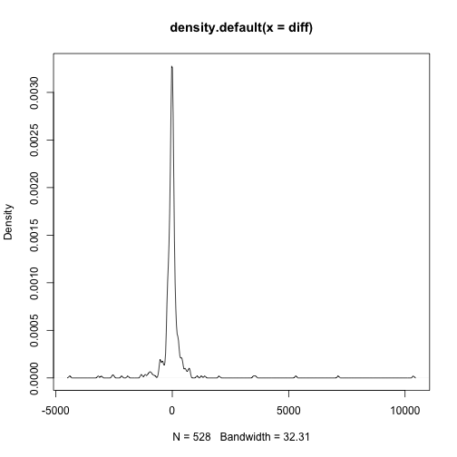
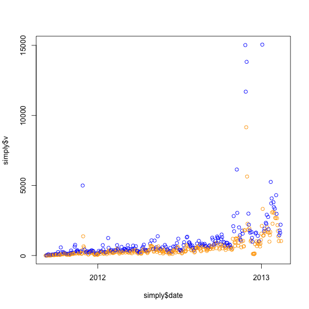
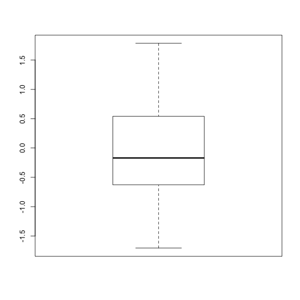
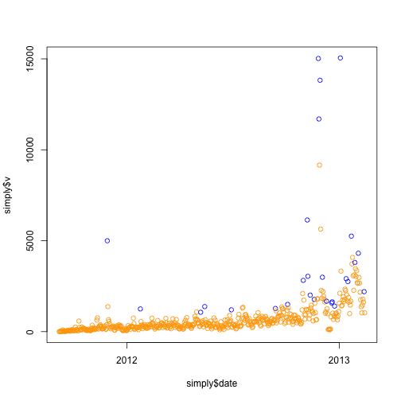

Find Peaks
=========


```r
## Load data
load("../../data/simply.Rdata")
load("../../data/posts.controversy.proc.Rdata")

## Calculate running means by 5 days I ran this with +-3 days and the
## results look worse in the sense that many peaks are next to each other.
runmeans <- data.frame(start = simply$date - 2, end = simply$date + 2, mean = rep(NA, 
    nrow(simply)))
for (i in 1:nrow(runmeans)) {
    runmeans$mean[i] <- mean(simply$v[simply$date >= runmeans$start[i] & simply$date <= 
        runmeans$end[i]])
}

## Some EDA on the running means
plot(simply$date, runmeans$mean)
```

 

```r
plot(simply$v, runmeans$mean)
```

 

```r
## This one looks useful to choose the peaks
plot(simply$v - runmeans$mean)
abline(h = 0, col = "red")
```

 

```r

diff <- simply$v - runmeans$mean
plot(density(diff))
```

 

```r
summary(diff)
```

```
##    Min. 1st Qu.  Median    Mean 3rd Qu.    Max. 
##   -4410    -109     -17       0      59   10400
```

```r
## Not normal
qqnorm(diff)
```

 

```r

## Exploring the simply > 0 cutoff
plot(simply$date, simply$v, col = ifelse(diff > 0, "blue", "orange"))
```

 

```r
## It doesn't look great as some high values are marked in orange.  But in
## another sense, blue values are higher than orange ones.

## Looking at this in another way
boxplot(simply$v ~ diff > 0)
```

 

```r
t.test(simply$v ~ diff > 0)
```

```
## 
## 	Welch Two Sample t-test
## 
## data:  simply$v by diff > 0 
## t = -3.897, df = 285.7, p-value = 0.0001213
## alternative hypothesis: true difference in means is not equal to 0 
## 95 percent confidence interval:
##  -815.1 -268.0 
## sample estimates:
## mean in group FALSE  mean in group TRUE 
##               572.1              1113.7
```

```r
## Good significant difference
table(diff > 0)
```

```
## 
## FALSE  TRUE 
##   301   227
```

```r

### Time to find a better cutoff.

## 3rd quantile?
plot(simply$date, simply$v, col = ifelse(diff > quantile(diff, 0.75), "blue", 
    "orange"))
```

 

```r
table(diff > quantile(diff, 0.75))
```

```
## 
## FALSE  TRUE 
##   396   132
```

```r

## .9 quantile?
plot(simply$date, simply$v, col = ifelse(diff > quantile(diff, 0.9), "blue", 
    "orange"))
```

 

```r
table(diff > quantile(diff, 0.9))
```

```
## 
## FALSE  TRUE 
##   475    53
```

```r
boxplot(simply$v ~ diff > quantile(diff, 0.9))
```

 

```r
t.test(simply$v ~ diff > quantile(diff, 0.9))
```

```
## 
## 	Welch Two Sample t-test
## 
## data:  simply$v by diff > quantile(diff, 0.9) 
## t = -4.456, df = 52.53, p-value = 4.405e-05
## alternative hypothesis: true difference in means is not equal to 0 
## 95 percent confidence interval:
##  -3108 -1178 
## sample estimates:
## mean in group FALSE  mean in group TRUE 
##               589.8              2733.1
```

```r


## Lets take into accout the variation during the windows
runmeans$sd <- rep(NA, nrow(simply))
for (i in 1:nrow(runmeans)) {
    runmeans$sd[i] <- sd(simply$v[simply$date >= runmeans$start[i] & simply$date <= 
        runmeans$end[i]])
}

## Looks more 'Normal' as expected
plot((simply$v - runmeans$mean)/runmeans$sd)
```

 

```r

norm <- (simply$v - runmeans$mean)/runmeans$sd
qqnorm(norm)
qqline(norm, col = "red")
```

 

```r
## Hard to interpret T_T'

## Boxplot looks symmetric
boxplot(norm)
```

 

```r

## Shapiro Test (shouldn't take it's results much into account) indicate
## that it's not normal
shapiro.test(norm)
```

```
## 
## 	Shapiro-Wilk normality test
## 
## data:  norm 
## W = 0.9548, p-value = 1.215e-11
```

```r

## Summary info
summary(norm)
```

```
##    Min. 1st Qu.  Median    Mean 3rd Qu.    Max. 
## -1.7100 -0.6280 -0.1700 -0.0031  0.5410  1.7900
```

```r

## Surprinsingly bad results!
plot(simply$date, simply$v, col = ifelse(norm > quantile(norm, 0.9), "blue", 
    "orange"))
```

 


Taking a step back and looking at how the peaks would be using the quantile 0.9 for diff.


```r
plot(simply$date, simply$v, col = ifelse(diff > quantile(diff, 0.9), "blue", 
    "orange"))
```

 

```r
## Looks like some peaks are too close to each other
diff(simply$date[diff > quantile(diff, 0.9)])
```

```
## Time differences in days
##  [1] 31  1 17 45 12 20 10 14 18 18 17  7  7 28  7  4  4  3 13  6  1 26  3
## [24] 27  1 10 10  1 25  1  7  1  4  7  1  6  1  2  4  7  9  1  4 10 10  3
## [47]  6  2  4  3  3 10
```

```r
## 69 posts in those peak days out of 511 total
dim(posts[posts$date %in% simply$date[diff > quantile(diff, 0.9)], ])
```

```
## [1] 69  7
```

```r

## It's 10% days vs 13.5% posts
sum(diff > quantile(diff, 0.9))/length(diff)
```

```
## [1] 0.1004
```

```r
69/nrow(posts)
```

```
## [1] 0.135
```

```r

# quantile 0.95?
plot(simply$date, simply$v, col = ifelse(diff > quantile(diff, 0.95), "blue", 
    "orange"))
```

 

```r
diff(simply$date[diff > quantile(diff, 0.95)])
```

```
## Time differences in days
##  [1]  57 104   7  46  76  21  27   7   1   4   7   7   1   2   4   7   9
## [18]   1   4  10  10   3   6   6   6  10
```

```r
sum(diff > quantile(diff, 0.95))
```

```
## [1] 27
```


Looking at differences between the authors

```r

## Ahh, is the controversy related to the author?
tapply(posts$cont, posts$author, mean)
```

```
##           admin       Jeff Leek Rafael Irizarry      Roger Peng 
##           1.500           1.638           2.219           1.331 
## Steven Salzberg 
##           4.000
```

```r
with(posts, boxplot(cont ~ factor(author)))
```

 

```r
f <- lm(cont ~ factor(author), data = posts)
summary(f)
```

```
## 
## Call:
## lm(formula = cont ~ factor(author), data = posts)
## 
## Residuals:
##    Min     1Q Median     3Q    Max 
## -1.219 -0.638 -0.331  0.362  3.362 
## 
## Coefficients:
##                               Estimate Std. Error t value Pr(>|t|)  
## (Intercept)                      1.500      0.846    1.77    0.077 .
## factor(author)Jeff Leek          0.138      0.848    0.16    0.870  
## factor(author)Rafael Irizarry    0.719      0.851    0.84    0.399  
## factor(author)Roger Peng        -0.169      0.848   -0.20    0.842  
## factor(author)Steven Salzberg    2.500      1.197    2.09    0.037 *
## ---
## Signif. codes:  0 '***' 0.001 '**' 0.01 '*' 0.05 '.' 0.1 ' ' 1 
## 
## Residual standard error: 0.846 on 506 degrees of freedom
## Multiple R-squared: 0.129,	Adjusted R-squared: 0.122 
## F-statistic: 18.7 on 4 and 506 DF,  p-value: 2.36e-14
```

```r
anova(f)
```

```
## Analysis of Variance Table
## 
## Response: cont
##                 Df Sum Sq Mean Sq F value  Pr(>F)    
## factor(author)   4     54   13.39    18.7 2.4e-14 ***
## Residuals      506    362    0.72                    
## ---
## Signif. codes:  0 '***' 0.001 '**' 0.01 '*' 0.05 '.' 0.1 ' ' 1
```

```r
## very low p-value, butat that seems to be due to Steven's post
f2 <- lm(cont ~ factor(author), data = posts, subset = author %in% c("Jeff Leek", 
    "Rafael Irizarry", "Roger Peng"))
summary(f2)
```

```
## 
## Call:
## lm(formula = cont ~ factor(author), data = posts, subset = author %in% 
##     c("Jeff Leek", "Rafael Irizarry", "Roger Peng"))
## 
## Residuals:
##    Min     1Q Median     3Q    Max 
## -1.219 -0.638 -0.331  0.362  3.362 
## 
## Coefficients:
##                               Estimate Std. Error t value Pr(>|t|)    
## (Intercept)                     1.6385     0.0606   27.04  < 2e-16 ***
## factor(author)Rafael Irizarry   0.5803     0.1123    5.17  3.5e-07 ***
## factor(author)Roger Peng       -0.3073     0.0820   -3.75    2e-04 ***
## ---
## Signif. codes:  0 '***' 0.001 '**' 0.01 '*' 0.05 '.' 0.1 ' ' 1 
## 
## Residual standard error: 0.846 on 506 degrees of freedom
## Multiple R-squared: 0.116,	Adjusted R-squared: 0.113 
## F-statistic: 33.4 on 2 and 506 DF,  p-value: 2.48e-14
```

```r
anova(f2)
```

```
## Analysis of Variance Table
## 
## Response: cont
##                 Df Sum Sq Mean Sq F value  Pr(>F)    
## factor(author)   2     48   23.88    33.4 2.5e-14 ***
## Residuals      506    362    0.72                    
## ---
## Signif. codes:  0 '***' 0.001 '**' 0.01 '*' 0.05 '.' 0.1 ' ' 1
```

```r
## Ok, now all of the authors seem different!!

## Lets look at the Jeff vs Rafa vs Roger
table(posts$author)
```

```
## 
##           admin       Jeff Leek Rafael Irizarry      Roger Peng 
##               1             195              80             234 
## Steven Salzberg 
##               1
```

```r
posts.filt <- subset(posts, author %in% c("Jeff Leek", "Rafael Irizarry", "Roger Peng"))
t.test(posts.filt$cont ~ posts.filt$author == "Roger Peng")
```

```
## 
## 	Welch Two Sample t-test
## 
## data:  posts.filt$cont by posts.filt$author == "Roger Peng" 
## t = 6.368, df = 480.1, p-value = 4.482e-10
## alternative hypothesis: true difference in means is not equal to 0 
## 95 percent confidence interval:
##  0.3292 0.6230 
## sample estimates:
## mean in group FALSE  mean in group TRUE 
##               1.807               1.331
```

```r
t.test(posts.filt$cont ~ posts.filt$author == "Jeff Leek")
```

```
## 
## 	Welch Two Sample t-test
## 
## data:  posts.filt$cont by posts.filt$author == "Jeff Leek" 
## t = -0.9814, df = 399.1, p-value = 0.327
## alternative hypothesis: true difference in means is not equal to 0 
## 95 percent confidence interval:
##  -0.24366  0.08139 
## sample estimates:
## mean in group FALSE  mean in group TRUE 
##               1.557               1.638
```

```r
t.test(posts.filt$cont ~ posts.filt$author == "Rafael Irizarry")
```

```
## 
## 	Welch Two Sample t-test
## 
## data:  posts.filt$cont by posts.filt$author == "Rafael Irizarry" 
## t = -5.844, df = 95.76, p-value = 7.015e-08
## alternative hypothesis: true difference in means is not equal to 0 
## 95 percent confidence interval:
##  -1.0019 -0.4939 
## sample estimates:
## mean in group FALSE  mean in group TRUE 
##               1.471               2.219
```

```r
## Only Jeff is not significantly different from the other 2. I mean, Jeff
## vs (Roger + Rafa).

t.test(posts.filt$cont[posts.filt$author == "Roger Peng"], posts.filt$cont[posts.filt$author == 
    "Rafael Irizarry"])
```

```
## 
## 	Welch Two Sample t-test
## 
## data:  posts.filt$cont[posts.filt$author == "Roger Peng"] and posts.filt$cont[posts.filt$author == "Rafael Irizarry"] 
## t = -6.854, df = 100, p-value = 5.989e-10
## alternative hypothesis: true difference in means is not equal to 0 
## 95 percent confidence interval:
##  -1.1445 -0.6306 
## sample estimates:
## mean of x mean of y 
##     1.331     2.219
```

```r
t.test(posts.filt$cont[posts.filt$author == "Roger Peng"], posts.filt$cont[posts.filt$author == 
    "Jeff Leek"])
```

```
## 
## 	Welch Two Sample t-test
## 
## data:  posts.filt$cont[posts.filt$author == "Roger Peng"] and posts.filt$cont[posts.filt$author == "Jeff Leek"] 
## t = -3.886, df = 346.3, p-value = 0.000122
## alternative hypothesis: true difference in means is not equal to 0 
## 95 percent confidence interval:
##  -0.4628 -0.1518 
## sample estimates:
## mean of x mean of y 
##     1.331     1.638
```

```r
t.test(posts.filt$cont[posts.filt$author == "Rafael Irizarry"], posts.filt$cont[posts.filt$author == 
    "Jeff Leek"])
```

```
## 
## 	Welch Two Sample t-test
## 
## data:  posts.filt$cont[posts.filt$author == "Rafael Irizarry"] and posts.filt$cont[posts.filt$author == "Jeff Leek"] 
## t = 4.188, df = 127.5, p-value = 5.221e-05
## alternative hypothesis: true difference in means is not equal to 0 
## 95 percent confidence interval:
##  0.3061 0.8545 
## sample estimates:
## mean of x mean of y 
##     2.219     1.638
```

```r

## So, Rafa posts the most controversial posts followed by Jeff and
## finally Roger.
```


Ok, time to get the peaks for quantiles 0.9 and 0.95

```r

## Function that gets the start and end
limitPeak <- function(df) {
    data.frame(start = df$date[1], end = df$date[nrow(df)])
}
## Main function for finding the peaks
getPeaks <- function(df, diff, q, space = 1) {
    i <- which(diff > quantile(diff, q))
    dates <- df$date[i]
    dates.diff <- diff(dates)
    
    ## For peaks far from each other find the start and end date of the peak
    j <- which(dates.diff <= space)
    good <- i[-c(j, j + 1)]
    res <- lapply(good, function(x) {
        limitPeak(df[x, ])
    })
    res <- do.call(rbind, res)
    
    ## In peaks too close to each other, find the day with the highest value
    ## and call it the peak day
    if (length(j) > 0) {
        while (length(j) > 0) {
            k <- j[1]
            j <- j[-1]
            if (length(j) > 0) {
                while (j[1] - k[length(k)] == 1) {
                  k <- c(k, j[1])
                  j <- j[-1]
                  if (length(j) == 0) 
                    break
                }
            }
            info <- df[i[c(k, k[length(k)] + 1)], ]
            res <- rbind(res, limitPeak(info))
            ## Now that we have the k groups
        }
    }
    
    ## End
    res <- res[order(res$start), ]
    res$ndays <- as.integer(res$end - res$start) + 1
    return(res)
}

## Gets the peaks for quantile .9 and 0.95 for the difference.  Compare
## with space =1 and space = 2
p95 <- getPeaks(simply, diff, 0.95)
p95.2 <- getPeaks(simply, diff, 0.95, 2)
p90 <- getPeaks(simply, diff, 0.9)
p90.2 <- getPeaks(simply, diff, 0.9, 2)

## Checking posts in that large peak
subset(posts, date >= "2012-11-26" & date <= "2012-11-29")
```

```
##           date          author
## 505 2012-11-26       Jeff Leek
## 504 2012-11-27 Rafael Irizarry
##                                                                                          title
## 505 The statisticians at Fox News use classic and novel graphical techniques to lead with data
## 504                                                       I give up, I am embracing pie charts
##     type leo1 leo2 cont
## 505 <NA>    5    5    5
## 504 <NA>    4    4    4
```


Proceed


